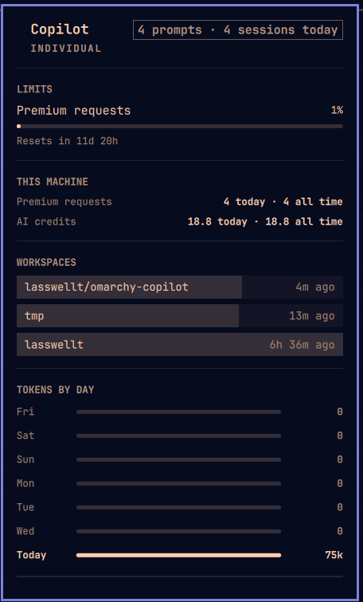

# Copilot — an Omarchy plugin

GitHub Copilot's premium-request quota, token usage, and rated cost in the
[Omarchy](https://omarchy.org) bar — and, from the same data, a tab in the
built-in Agents panel next to Claude and Codex.



## What it shows

- **Premium requests** — the share of the monthly allowance spent, with a
  countdown to the reset. Read live from the Copilot CLI's own runtime, not
  from a cache file, so it is current rather than whatever your last
  interactive session left behind.
- **This machine** — that meter is account-wide: it counts the IDE, the web,
  and every other machine you use. Underneath it, the premium requests and
  AI credits that were spent *here*. Copilot rates every call in
  nano-AI-units and calls the result "AI credits" in its own UI; no other
  agent on this machine reports a cost figure at all.
- **Workspaces** — where the work happened, newest first: the repository
  (`owner/name`, from the git remote), how long ago, and the branch, sessions
  and prompts on hover. Sessions started outside a repository show their
  directory.
- **Tokens by day and by model** — the last week, and the all-time split per
  model, with the input / output / cache breakdown on hover.
- **Today** — prompts and sessions, in the hero line.

The icon leaves the bar entirely on a machine that has never run Copilot, and
arrives on its own after the first scan finds usage.

| Key | |
|---|---|
| `j` / `k` | scroll |
| `r` / Enter | refresh now |
| `o` | open Copilot in a terminal |
| Tab | neighbouring panel |
| Esc | close |

Right-clicking the bar icon opens Copilot; left-clicking toggles the panel.

## How it works

Two entry points over one data file.

```
bin/copilot-usage ──► ~/.local/state/omarchy/agents/usage/copilot.json
                          │                    ▲
                          │                    └── Service.qml, on a timer
                          ├──► the built-in Agents panel (omarchy.agents)
                          └──► Panel.qml, this plugin's own bar widget
```

`bin/copilot-usage` prints one JSON record in the same contract the
first-party `omarchy-agent-usage-*` collectors print. `Service.qml` runs it on
a timer and publishes the record; the Agents panel adopts any record that
appears in that directory — the filename is the agent id — and `Panel.qml`
reads the identical file. There is one data path and two views of it, so the
two panels can never disagree.

The record comes from two sources:

| | |
|---|---|
| Quota, plan, sign-in | The CLI's own JSON-RPC runtime (`copilot --headless --stdio`), via `account.getQuota` and `account.getCurrentAuth`. Account-wide, and about 1.4 s per call. Spends no premium requests. |
| Tokens, prompts, sessions, premium requests, workspaces | `~/.copilot/session-store.db`, read-only. Machine-local. |

If the runtime will not start, the collector falls back to the disposable
cache the CLI keeps for itself and labels the meter "Quota from cache" — it
can be arbitrarily stale, and saying so beats drawing a meter that looks
current. Local stats are unaffected either way: they are real whether or not
GitHub is reachable.

`~/.copilot` and `~/.cache/copilot` are honored through the CLI's own
`COPILOT_HOME` and `COPILOT_CACHE_HOME` overrides.

See [`roadmap.md`](roadmap.md) for how all of this was derived — including the
three traps that a naive reading of Copilot's data falls into — and
[`findings.md`](findings.md) for where Copilot keeps things on disk.

## Settings

One, in the bar widget's settings (`omarchy` menu → Bar → Copilot):

| Setting | Default | |
|---|---|---|
| `refreshIntervalSec` | 900 | How often to re-read the quota and rescan local sessions. Floored at 60. |

The service reads the same value out of the bar layout, so the schedule is
one setting whether or not the widget is in the bar.

## Install

```bash
omarchy plugin add https://github.com/lasswellt/omarchy-copilot.git --enable
```

Both surfaces come from that one install. To use only the Agents-panel tab,
remove the Copilot widget from the bar and leave the plugin enabled — the
service keeps publishing.

## Commands

```bash
copilot-usage                    # print the record, change nothing
copilot-usage-update             # publish it to the Agents usage directory
copilot-usage-update --force     # ignore the scan cache
copilot-usage-update --stdout    # print what it would publish

omarchy-shell lasswellt.copilot toggle        # the panel
omarchy-shell lasswellt.copilot status        # headline numbers as JSON
omarchy-shell lasswellt.copilot.data refresh  # publish now, panel closed
```

`status` reads the record already in memory, so it costs nothing and never
blocks — cheap enough for a prompt segment or a polling script:

```console
$ omarchy-shell lasswellt.copilot status | jq -r '"\(.percentUsed)% used · \(.premiumTotal) from here"'
1% used · 4 from here
```

## Tests

```bash
./tests/run      # contract tests: 1480 checks, no network, no real home dir
./tests/lint     # manifest, shell, python, qmllint
```

`tests/run` builds a throwaway `COPILOT_HOME` and puts `tests/fake-copilot` —
a stand-in that speaks the real JSON-RPC framing — ahead of the CLI on PATH,
so the RPC client is exercised rather than mocked. It also asserts, against
the real database when there is one, the identity the token mapping rests on:
that `input_tokens` is the inclusive total, that `output_tokens` matches the
details' output entry with reasoning tokens already inside it, and that no
`reasoning` token type exists to be added. If Copilot ever changes that, the
tests say so.

## Dev loop

This directory is the source of truth. The installed copy at
`~/.config/omarchy/plugins/lasswellt.copilot` is a git clone whose `origin` is
this directory, so a local commit is enough — nothing needs pushing to test.

```bash
cd ~/Projects/omarchy-copilot
./tests/run && ./tests/lint
git add -A && git commit -m "..."
omarchy plugin update lasswellt.copilot --yes
omarchy restart shell
```

That last line is not optional, and it is worth knowing why. `omarchy plugin
update` pulls the files, the shell re-reads the manifest — `omarchy plugin
list` shows the new `kinds` at once — and the registry's `inotifywait` watcher
does log `Local plugin changed, reloading: lasswellt.copilot`. None of that
re-reads QML. Tested directly: a method added to `Panel.qml`, committed and
pulled, was still "Function not found." eight seconds after the update, and
appeared the moment the shell restarted. `omarchy-shell shell rescanPlugins`
does not help either.

So without a restart the bar keeps running the previous `Panel.qml` and never
starts a newly declared service, which looks exactly like a plugin that does
not work. Check with a method only the new code has — not one both versions
share, since `toggle` answered fine from the old stub:

```bash
omarchy-shell lasswellt.copilot refresh       # "Function not found." = still the old QML
omarchy-shell lasswellt.copilot.data refresh  # "Target not found."   = service not loaded
```

`omarchy restart shell` refuses while the session is locked, by design.

## Known limits

- **No mark in the Agents panel.** That panel resolves an agent's logo as
  `assets/<id>.svg` relative to its own directory, which is root-owned under
  `/usr/share/omarchy`. A third-party plugin cannot install one there, so the
  Copilot tab falls back to the bar glyph. This plugin's own panel has its
  own icon and is unaffected.
- **The quota meter is account-wide.** It includes what the IDE, the web, and
  your other machines spent, because that is what GitHub bills. Everything
  under "this machine" is local, and the two will not match. That split is
  inherent to where each number comes from, and showing both is the point.

## License

MIT. See [`LICENSE`](LICENSE).
